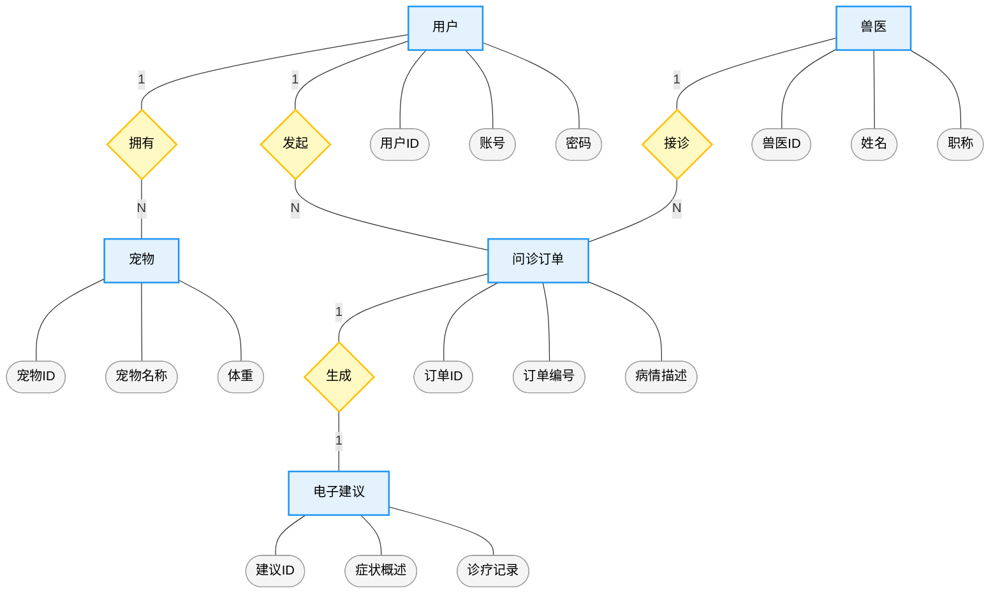

```mermaid
flowchart TD
    %% 定义样式
    classDef entity fill:#E3F2FD,stroke:#2196F3,stroke-width:2px,color:#000;
    classDef relation fill:#FFF9C4,stroke:#FFC107,stroke-width:2px,shape:rhombus,color:#000;
    classDef attribute fill:#F5F5F5,stroke:#9E9E9E,stroke-width:1px,shape:ellipse,color:#000;

    %% 实体定义 (矩形)
    User[用户]:::entity
    Pet[宠物]:::entity
    Doctor[兽医]:::entity
    Order[问诊订单]:::entity
    Advice[电子建议]:::entity

    %% 联系定义 (菱形)
    Rel1{拥有}:::relation
    Rel2{发起}:::relation
    Rel3{接诊}:::relation
    Rel4{生成}:::relation

    %% 实体间的联系及 1:N、1:1 比例
    User ---|1| Rel1 ---|N| Pet
    User ---|1| Rel2 ---|N| Order
    Doctor ---|1| Rel3 ---|N| Order
    Order ---|1| Rel4 ---|1| Advice

    %% 用户属性 (椭圆)
    U1([用户ID]):::attribute
    U2([账号]):::attribute
    U3([密码]):::attribute
    User --- U1
    User --- U2
    User --- U3

    %% 宠物属性 (椭圆)
    P1([宠物ID]):::attribute
    P2([宠物名称]):::attribute
    P3([体重]):::attribute
    Pet --- P1
    Pet --- P2
    Pet --- P3

    %% 兽医属性 (椭圆)
    D1([兽医ID]):::attribute
    D2([姓名]):::attribute
    D3([职称]):::attribute
    Doctor --- D1
    Doctor --- D2
    Doctor --- D3

    %% 订单属性 (椭圆)
    O1([订单ID]):::attribute
    O2([订单编号]):::attribute
    O3([病情描述]):::attribute
    Order --- O1
    Order --- O2
    Order --- O3

    %% 建议属性 (椭圆)
    A1([建议ID]):::attribute
    A2([症状概述]):::attribute
    A3([诊疗记录]):::attribute
    Advice --- A1
    Advice --- A2
    Advice --- A3
```