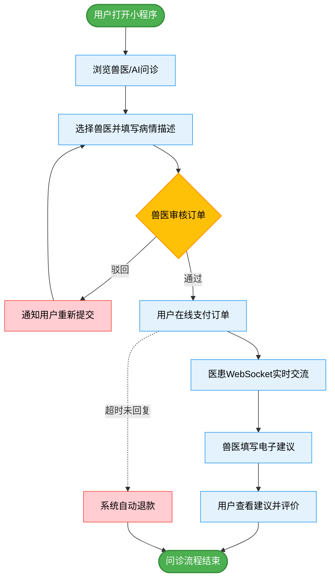

```mermaid
flowchart TD
    %% 定义节点形状与内容
    Start([用户打开小程序])
    Browse[浏览兽医/AI问诊]
    Submit[选择兽医并填写病情描述]
    Audit{兽医审核订单}
    Reject[通知用户重新提交]
    Pay[用户在线支付订单]
    Chat[医患WebSocket实时交流]
    Timeout[系统自动退款]
    Advice[兽医填写电子建议]
    Evaluate[用户查看建议并评价]
    End([问诊流程结束])
    
    %% 定义流程连线
    Start --> Browse
    Browse --> Submit
    Submit --> Audit
    
    Audit -->|驳回| Reject
    Reject --> Submit
    Audit -->|通过| Pay
    
    Pay --> Chat
    Pay -.->|超时未回复| Timeout
    
    Chat --> Advice
    Advice --> Evaluate
    
    Evaluate --> End
    Timeout --> End
    
    %% 定义节点样式
    classDef startEnd fill:#4CAF50,color:white,stroke:#388E3C,stroke-width:2px;
    classDef decision fill:#FFC107,color:black,stroke:#FFA000,stroke-width:2px;
    classDef process fill:#E3F2FD,color:black,stroke:#2196F3,stroke-width:1px;
    classDef error fill:#FFCDD2,color:black,stroke:#F44336,stroke-width:1px;
    
    class Start,End startEnd;
    class Audit decision;
    class Browse,Submit,Pay,Chat,Advice,Evaluate process;
    class Reject,Timeout error;
```